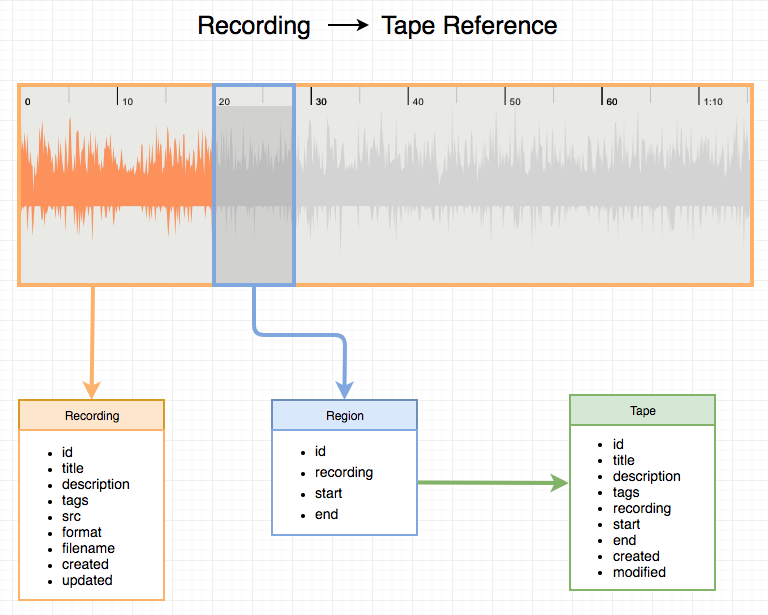

# Tapes
## Installing the latest release
Go to [releases](https://github.com/phonofidelic/Tapes/releases) to find the latest version. At the moment, recording audio with Tapes requires [SoX](http://sox.sourceforge.net/) to be installed on your machine ([download](https://sourceforge.net/projects/sox/files/sox/)).

## Introduction
### Description
Tapes is intended to be an intuitive, low latency interface for creating and cataloging audio recordings using the computer’s default audio input device (mic input or USB capture device). Recordings are saved to user-selected directory in the computer's file system. 

The user can compose metadata for the recordings, making them searchable and sortable through tags and descriptions. The user can also create “Tape” documents - object containing reference to recordings, but have no physical space on the machine themselves. Tape documents point to samples of Recordings by ID and time references. Once a Tape has been created, it can then be exported to a desired audio format to be used in other audio editing software.

### Motivation
Part of my motivation behind this project is to gain a deeper understanding of the various technologies and frameworks used to build it. It also proved to be a good way to introduce myself to some basic concepts of audio signal processing and dealing with digital audio data. My main motivation however, was to build a tool that I found useful and pleasant to work with. I wanted an application that could quickly record musical ideas or sound samples with minimal setup and also allow for efficient archival of the generated material.

## Development
### Installation:
`git clone https://github.com/phonofidelic/Tapes.git && cd Tapes`

### Scripts:
`yarn`
install dependencies

`yarn react-start`
starts react development server

`yarn electron`
launches the electron application

`yarn build`
creates the production build

